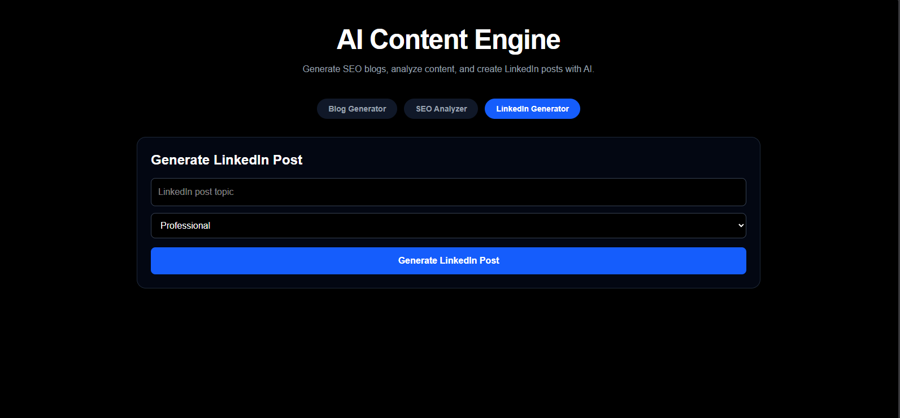
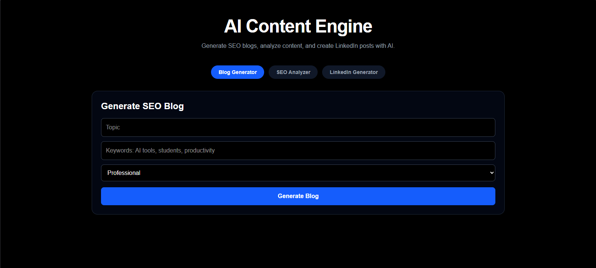
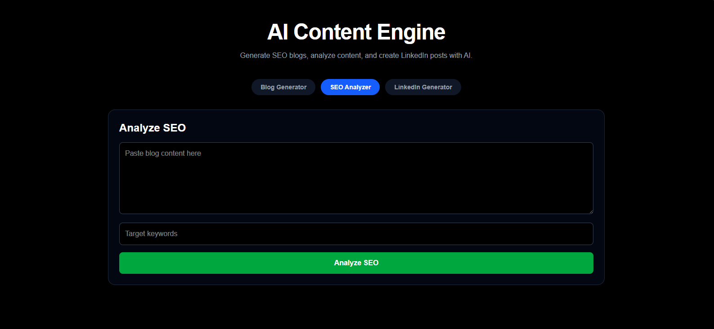

# ✍️ AI SEO Content Engine


An AI-powered full-stack content generation platform that helps users generate SEO-optimized blogs, LinkedIn posts, and AI-written marketing content using Large Language Models (LLMs).

The system combines prompt engineering, AI text generation, SEO analysis, keyword optimization, and modern frontend design to generate high-quality content in real time.

---

# 🔗 Live Demo

### Frontend
https://ai-content-engine-alpha.vercel.app/

### Backend API
https://ai-content-engine-backend-9f1x.onrender.com

API Documentation
https://ai-content-engine-backend-9f1x.onrender.com/docs
---

# ✨ Features

- AI-powered blog generation
- SEO-optimized content creation
- LinkedIn post generation
- Keyword-focused writing
- AI marketing copy generation
- FastAPI REST API backend
- Modern responsive frontend
- Real-time content generation
- Prompt engineering workflows
- Clean SaaS-style UI
- Full-stack production deployment

---

# 📸 Screenshots

## Dashboard



---

## AI Blog Generation



---

## SEO Analysis



---

# 🧠 How It Works

1. User enters a topic or keyword.
2. Frontend sends request to FastAPI backend.
3. Prompt engineering structures the AI request.
4. Groq LLM generates optimized content.
5. SEO-focused formatting improves readability.
6. Generated content is displayed instantly on frontend.

---

# 🏗️ System Architecture

```text
User Input
    │
    ▼
React Frontend
    │
    ▼
FastAPI Backend
    │
    ▼
Prompt Engineering Layer
    │
    ▼
Groq LLM API
    │
    ▼
AI Content Generation
    │
    ▼
SEO Optimized Output

---

🛠️ Tech Stack
Backend
Python
FastAPI
Uvicorn
Groq API
Pydantic
Frontend
React
JavaScript
CSS
Axios
AI / NLP
Prompt Engineering
SEO Content Optimization
Large Language Models (LLMs)
AI Text Generation

---

📂 Project Structure
AI_SEO_CONTENT_ENGINE/
│
├── backend/
│   ├── main.py
│   ├── requirements.txt
│   ├── .env
│   └── services/
│
├── frontend/
│   ├── src/
│   ├── public/
│   ├── package.json
│   └── vite.config.js
│
├── screenshots/
│   ├── dashboard.png
│   ├── blog_generator.png
│   └── seo_analysis.png
│
├── .gitignore
├── LICENSE
└── README.md

---

⚙️ Installation & Setup
1️⃣ Clone Repository
git clone https://github.com/catonlsd/ai-seo-content-engine.git
cd AI_SEO_CONTENT_ENGINE

2️⃣ Backend Setup
Navigate to backend directory:

cd backend

Create virtual environment:

Windows
python -m venv venv
venv\Scripts\activate
Mac/Linux
python3 -m venv venv
source venv/bin/activate

Install dependencies:

pip install -r requirements.txt

Create .env file:

GROQ_API_KEY=YOUR_GROQ_API_KEY

Run backend server:

python -m uvicorn main:app --reload

Backend runs at:

http://127.0.0.1:8000

---

3️⃣ Frontend Setup

Navigate to frontend:

cd frontend

Install dependencies:

npm install

Run frontend:

npm run dev

Frontend runs at:

http://localhost:5173
🔌 API Endpoints
POST /generate-blog

Generates SEO-optimized blog content.

POST /generate-linkedin-post

Generates AI-powered LinkedIn posts.

POST /seo-analysis

Analyzes content for SEO quality.

---

💬 Example Prompts
Generate a blog on Artificial Intelligence.

Create a LinkedIn post about remote work.

Write SEO content on cloud computing.

Generate a startup marketing copy.

Create a professional LinkedIn article.

---

🧠 AI Concepts Used
Prompt Engineering
AI Content Generation
SEO Optimization
NLP-based Text Generation
Large Language Models (LLMs)

---

📈 Future Improvements
User authentication
Content export
AI image generation
Content templates
Multi-language support
AI plagiarism detection
Keyword ranking analysis
Team collaboration tools
Content scheduling

---

📄 Resume Description

Built a full-stack AI-powered SEO Content Engine using FastAPI, React, and Groq LLM to generate SEO-optimized blogs, LinkedIn posts, and marketing content. Implemented prompt engineering workflows, real-time AI content generation, responsive frontend design, and REST API architecture for scalable AI-driven content automation.

👨‍💻 Author

**Mokshit**